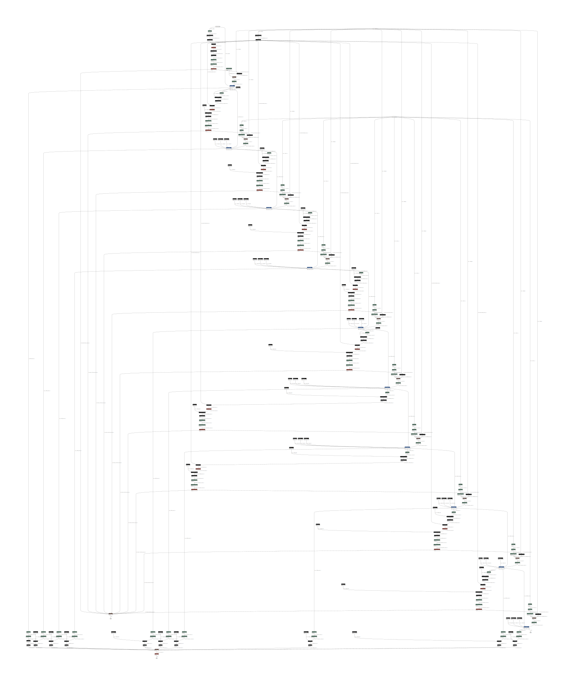

# BaAttention
## Overview
The Bahdanau attention mechanism uses a one-hidden layer feed-forward network to calculate the attention alignment score4. The score for each encoder hidden state is calculated using a feed-forward network with a single hidden layer. The inputs to this network are the current decoder hidden state and the particular encoder hidden state. The output is then passed through a softmax function to produce the attention weights
## Process
1. predefine denser layer which produces key vector, query vector and value vector
```
self.Wa = nn.Linear(hidden_size, hidden_size)
self.Ua = nn.Linear(hidden_size, hidden_size)
self.Va = nn.Linear(hidden_size, 1)
```
2. prepare query and keys
- the 'query' comes from these two ways: the encoder_hidden at the very beginning and the hidden state from the previous RNN unit
```
decoder_hidden = encoder_hidden
```
```
ecoder_output, decoder_hidden, attn_weights = self.forward_step(
                decoder_input, decoder_hidden, encoder_outputs
            )
```
```
query = hidden.permute(1,0,2)
```
- the keys comes from the output of the encoder
```
context, attn_weights = self.attention(query, encoder_outputs)
```
- but for the visulization blog, the 'keys' comes from the hidden states of the encoder, 
and the 'query' comes from the hidden state of the previous decoder unit, conbine context and decoder hidden state to produce the output
3. calculate the scores. 
- get the query vector and key vector
- add up these two vectors
- pass to tanh activation
- use Va dense layer to generate scores
- change the shape of the score
```
scores = self.Va(torch.tanh(self.Wa(query) + self.Ua(keys)))
        scores = scores.squeeze(2).unsqueeze(1)
```
4. calculate weigths by softmax
```
weights = F.softmax(scores, dim=-1)
```
5. compute the context
The torch.bmm() function in PyTorch performs a batch matrix multiplication of two 3D tensors.
```
context = torch.bmm(weights, keys)
```
# AttnDecoderRNN
1. define some methods
- the input of the RNN unit is the concatenation of embedded input and context
```
self.gru = nn.GRU(2*hidden_size, hidden_size, batch_first=True)
```
2. forward_step(self, input, hidden, encoder_outputs)
- query is from the repremution of the hidden
- combine the embedded and context into the input of GRU
```
input_gru = torch.cat((embedded, context), dim=2)
```
# Shape
1. Attention model
- query: [32, 1, 128] --- batch_size, one word/feature, hidden_size
- keys: [32, 10, 128] --- batch_size, possible choices for the feature/word, hidden_size
- query vector: [32, 1, 128]
- keys vector: [32, 10, 128]
- scores: [32, 1, 10] --- batch_size, , scores for each choice
- scores(2)/weights: [32, 10, 1]
- context: [32, 1, 128]

2. forward part:

3. output:

# ONNX model:
