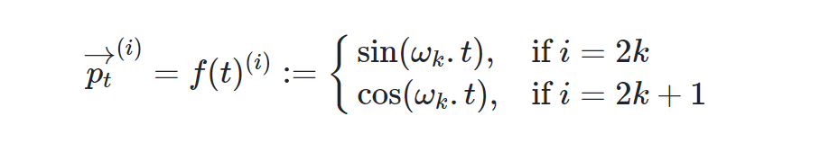
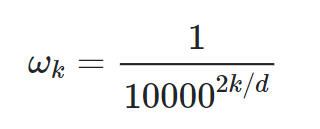
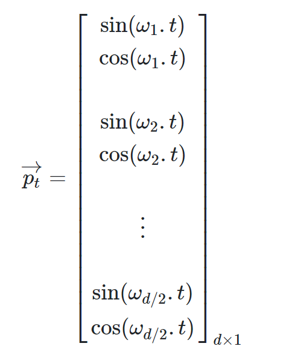

# Background
## GPU, ByteNet, ConvS2S
- pos: parallel with CNN
- cons: linear/ logarithmical complexity when considering position info
## Transformer
1. The number of operations required to relate signals from two arbitrary input or output positions is reduced to constant.
2. Introduce Multi-Head Attention
- to avoid reduced effective resolution(?)
> **NOTE:**  1. When your data's underlying structure is lower dimensional this should be fine for the most part when it comes to representing the data, but the benefit comes from the feedforward layer right after the attention mechanism — whereas single head attention would return what can be interpreted as some average of features that the layer is attending to, multihead attention outputs what are basically separate lower dimensional vectors, where the span of these is accessible to the ff layer. So while technically the dimension of the output of the layer is the same, it more easily preserves information about the structure of its input for the following layer.https://ai.stackexchange.com/questions/41274/why-does-averaging-attention-weighted-positions-reduce-the-effective-resolution?newreg=1447015144dd4b5189ab01a278b677ee;
> **NOTE:** 2. (1)It expands the model’s ability to focus on different positions. Yes, in the example above, z1 contains a little bit of every other encoding, but it could be dominated by the actual word itself. If we’re translating a sentence like “The animal didn’t cross the street because it was too tired”, it would be useful to know which word “it” refers to.(2)t gives the attention layer multiple “representation subspaces”. As we’ll see next, with multi-headed attention we have not only one, but multiple sets of Query/Key/Value weight matrices (the Transformer uses eight attention heads, so we end up with eight sets for each encoder/decoder). Each of these sets is randomly initialized. Then, after training, each set is used to project the input embeddings (or vectors from lower encoders/decoders) into a different representation subspace. https://jalammar.github.io/illustrated-transformer/
3. Self-attention 
-  an attention mechanism relating different positions of a single sequence in order to compute a representation of the sequence
> **NOTE:** 1. context or positions?
# Model Architecture
## Overview
- Encoder-decoder sturcture
- stacked self-attention and point-wise fully connected layers 
## Encoder
1. residual connection
A residual connection, also known as a skip connection, allows the output of one layer to be added to the output of a later layer. This helps to mitigate the vanishing gradient problem and facilitates the training of much deeper networks. It essentially creates a shortcut or a bypass for the gradient to flow through during backpropagation.
https://en.wikipedia.org/wiki/Residual_neural_network
https://deepai.org/machine-learning-glossary-and-terms/residual-connections
https://stats.stackexchange.com/questions/321054/what-are-residual-connections-in-rnns
2. layer normalization
Layer normalization is a technique used to stabilize the training process and improve the performance of neural networks5. It works by normalizing the activations for **each** individual sample in a batch, by subtracting the mean and dividing by the standard deviation. Unlike batch normalization, layer normalization does not impose any constraint on the size of the mini-batch and it can be used in the pure online regime with batch size.
https://paperswithcode.com/method/layer-normalization
https://medium.com/@minh.hoque/demystifying-neural-network-normalization-techniques-4a21d35b14f8

$$scale\_ factor\times \frac{x-mean}{standard-derivation+eps} + shift\_ factor $$
> **NOTE:** In this implementation, layer norm is applied on the input of a sublayer but not on the output of residual connection.
## Decoder
1. encoder-decoder attention
In addition to the two sub-layers in each encoder layer, the decoder inserts a third sub-layer, which performs multi-head attention over the output of the encoder stack.
2. mask
Modify the self-attention sub-layer in the decoder stack to prevent positions from attending to subsequent positions. The predictions for position i can depend only on the known outputs at positions less than i
## Attention
1. Scaled Dot-Product Attention(taken)
$$Attention(Q,K,V) = softmax(\frac{QK^{T}}{\sqrt{d_{k}}})V$$
- Dot-Product attention 
    - pos: much faster and more space-efficient
    - cons: for large values, the dot products grow large in magnitude, pushing the softmax function into regions where it has extremely small gradients
- Addictive attention
    - Outperforms dot-product attention without scaling for large values
2. Multi-head attention
Allows the model to jointly attend to information from different representation subspaces at different positions
3. Applications in transformer
- Encoder-decoder attention: queries come from previous decoder layer while memory keys and values come from the output of the encoder
- Encoder self-attention: all three vectors come from output of the previous layer in the encoder
- Decoder self-attention: mask out all values in the input of the softmax which correspond to following positions
## Position-wise Feed-Forward Networks
It consists of two linear transformations with a RELU activation in between
$$FFN(x)=max(0,xW_{1}+b_{1})W_{2}+b_{2}$$
## Embeddings and Softmax
multiply weights by $\sqrt{d_{model}}$
## Positional Encoding
https://kazemnejad.com/blog/transformer_architecture_positional_encoding/
1. Why
Recurrent Neural Networks (RNNs) inherently take the order of word into account; They parse a sentence word by word in a sequential manner. This will integrate the words’ order in the backbone of RNNs.But the Transformer architecture ditched the recurrence mechanism in favor of multi-head self-attention mechanism.
2. How
- Criteria:
    - It should output a unique encoding for each time-step (word’s position in a sentence)
    - Distance between any two time-steps should be consistent across sentences with different lengths. (It helps figure out how many words are present within a specific range)
    - Our model should generalize to longer sentences without any efforts. Its values should be bounded.
    - It must be deterministic.
- method

It's like the float version of binary encoding 
- property
    - For any offset k, $PE_{pos+k}$ can be represented as a linear function of $PE_{pos}$, thus allowing this model to easily learn to attend by relative positions
    - The distance between neighboring time-steps are symmetrical and decays nicely with time
# Model Training
## Batches and Masking
## Training Loop
## Training Data and Batching
## Hardware and Schedule
## Optimizer
Adam optimizer
## Regularization
label smoothing
- Label Smoothing is a regularization technique used in training Transformer models, and it’s designed to prevent the model from becoming overly confident about its predictions.In standard training, we use one-hot encoding for our labels, meaning that for each example, the model is trained to output a probability of 1 for the correct class and 0 for all other classes. However, this can lead to overfitting, as the model becomes overly certain about its predictions and may not generalize well to unseen data.Label Smoothing addresses this issue by softening the ground-truth labels. Instead of using a hard one-hot encoded vector, it uses a smoothed version where the value for the correct class is slightly less than 1, and a small value is distributed to the other classes23. This prevents the model from becoming overly confident about its predictions.The core idea is to penalize over-confident outputs and regularize the model so that its outputs do not diverge too much from some prior distribution2. While training perplexity generally gets worse, label smoothing is found to consistently improve test performance.
https://towardsdatascience.com/label-smoothing-make-your-model-less-over-confident-b12ea6f81a9a